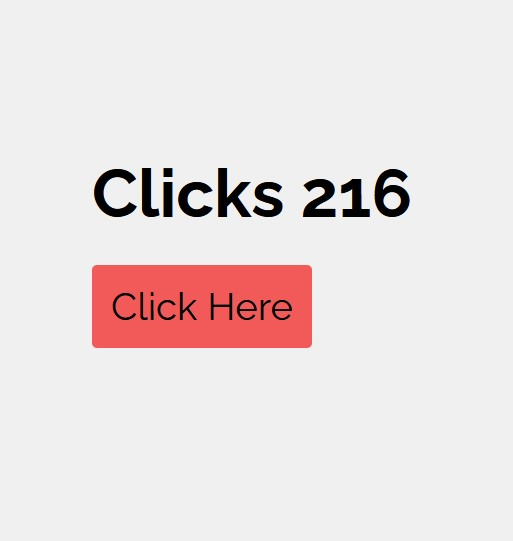

# COUNTER - SESL

Level 1 Challenge LightHouse SESL

A couter that increases when the button is clicked and does not revert to the initial count when the page is refreshed

## Screenshot

Screenshot of the mockup



Link to live site:-

-[Counter !!](https://counter-sesl.netlify.app/)


## Process

Used `localstorage` to ensure that the `count` state does not revert to `0` when the page is refreshed

```jsx

const [count, setCount] = useState(localStorage.getItem("yourCount") || 0);

  useEffect(() => {
    localStorage.setItem("yourCount", count);
  }, [count]);

<button onClick={() => setCount((count) => JSON.parse(count) + 1)} > Click Here</button>

```